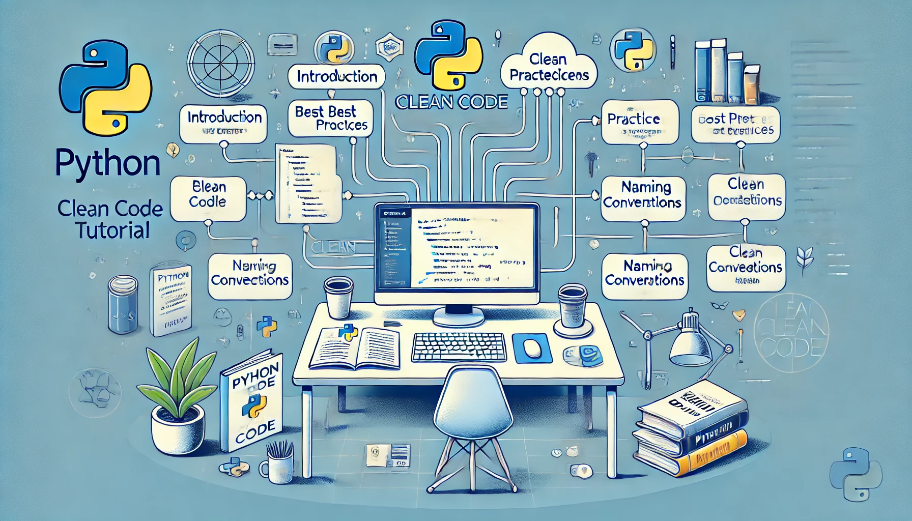

# Python Clean Code Tutorial 🐍

**`Main`** \|\| [`01-01`](https://github.com/copilot-id/python-clean-code/tree/01-01) \|\| [`01-02`](https://github.com/copilot-id/python-clean-code/tree/01-02) \|\| [`01-03`](https://github.com/copilot-id/python-clean-code/tree/01-03) \|\| [`01-04`](https://github.com/copilot-id/python-clean-code/tree/01-04) \|\| [`01-05`](https://github.com/copilot-id/python-clean-code/tree/01-05) \|\| [`01-06`](https://github.com/copilot-id/python-clean-code/tree/01-06) \|\| [`01-07`](https://github.com/copilot-id/python-clean-code/tree/01-07) \|\| [`01-08`](https://github.com/copilot-id/python-clean-code/tree/01-08) \|\| [`01-09`](https://github.com/copilot-id/python-clean-code/tree/01-09) \|\| [`01-10`](https://github.com/copilot-id/python-clean-code/tree/01-10)

Welcome to the **Python Clean Code Tutorial**. This comprehensive guide will walk you through the essential principles and practices for writing clean, readable, and maintainable Python code. Each section is meticulously crafted with detailed explanations, practical examples, exercises, and solutions to ensure you gain a thorough understanding of clean coding techniques.

## Table of Contents

This tutorial is organized into `10 branches`, each corresponding to a specific section:

*Click the branch to go to the specific tutorial, or click the title to read the overview.*

| Branch  | Title |
|----|-------|
| [`01-01`](https://github.com/copilot-id/python-clean-code/tree/01-01) | [Introduction to Clean Code](#1-introduction-to-clean-code) |
| [`01-02`](https://github.com/copilot-id/python-clean-code/tree/01-02) | [Coding Standards and Best Practices](#2-coding-standards-and-best-practices) |
| [`01-03`](https://github.com/copilot-id/python-clean-code/tree/01-03) | [Naming Conventions](#3-naming-conventions) |
| [`01-04`](https://github.com/copilot-id/python-clean-code/tree/01-04) | [Functions and Methods](#4-functions-and-methods) |
| [`01-05`](https://github.com/copilot-id/python-clean-code/tree/01-05) | [Error Handling](#5-error-handling) |
| [`01-06`](https://github.com/copilot-id/python-clean-code/tree/01-06) | [Code Smells and Refactoring](#6-code-smells-and-refactoring) |
| [`01-07`](https://github.com/copilot-id/python-clean-code/tree/01-07) | [Unit Testing and Test-Driven Development (TDD)](#7-unit-testing-and-test-driven-development-tdd) |
| [`01-08`](https://github.com/copilot-id/python-clean-code/tree/01-08) | [Documentation and Comments](#8-documentation-and-comments) |
| [`01-09`](https://github.com/copilot-id/python-clean-code/tree/01-09) | [Code Reviews and Pair Programming](#9-code-reviews-and-pair-programming) |
| [`01-10`](https://github.com/copilot-id/python-clean-code/tree/01-10) | [Continual Improvement and Learning](#10-continual-improvement-and-learning) |

***

## 1. Introduction to Clean Code
- **Description:** Learn the basics of clean code, including its importance and principles. Understand the difference between messy and clean code through examples.
- **Folders:**
  - Main-Materi
  - Exercise
  - Solve Exercise

## 2. Coding Standards and Best Practices
- **Description:** Explore Python coding standards, such as PEP 8, and best practices to enhance code readability and maintainability.
- **Folders:**
  - Main-Materi
  - Exercise
  - Solve Exercise

## 3. Naming Conventions
- **Description:** Discover the importance of meaningful names for variables, functions, and classes. Learn standard naming conventions to improve code clarity.
- **Folders:**
  - Main-Materi
  - Exercise
  - Solve Exercise

## 4. Functions and Methods
- **Description:** Understand how to write clear and concise functions. Learn about the principles of single responsibility and DRY (Don't Repeat Yourself).
- **Folders:**
  - Main-Materi
  - Exercise
  - Solve Exercise

## 5. Error Handling
- **Description:** Master the art of handling errors and exceptions gracefully. Learn to use try-except blocks effectively to improve code robustness.
- **Folders:**
  - Main-Materi
  - Exercise
  - Solve Exercise

## 6. Code Smells and Refactoring
- **Description:** Identify common code smells and learn techniques for refactoring code to improve its quality and maintainability.
- **Folders:**
  - Main-Materi
  - Exercise
  - Solve Exercise

## 7. Unit Testing and Test-Driven Development (TDD)
- **Description:** Learn the importance of unit testing and the principles of TDD. Write tests to ensure your code works as expected and remains bug-free.
- **Folders:**
  - Main-Materi
  - Exercise
  - Solve Exercise

## 8. Documentation and Comments
- **Description:** Discover the best practices for documenting and commenting your code. Learn to write clear and concise documentation to help others understand your code.
- **Folders:**
  - Main-Materi
  - Exercise
  - Solve Exercise

## 9. Code Reviews and Pair Programming
- **Description:** Understand the benefits of code reviews and pair programming. Learn how to collaborate effectively with other developers to improve code quality.
- **Folders:**
  - Main-Materi
  - Exercise
  - Solve Exercise

## 10. Continual Improvement and Learning
- **Description:** Embrace a mindset of continual learning and improvement. Discover various ways to stay updated with the latest trends and practices in programming.

## Additional Resources
- **Books and Articles:** Recommended reading materials to deepen your understanding of clean code and best practices.
- **Online Courses:** Suggested online courses to further your learning journey.
- **Community and Forums:** Join developer communities and forums to share knowledge and seek advice.
